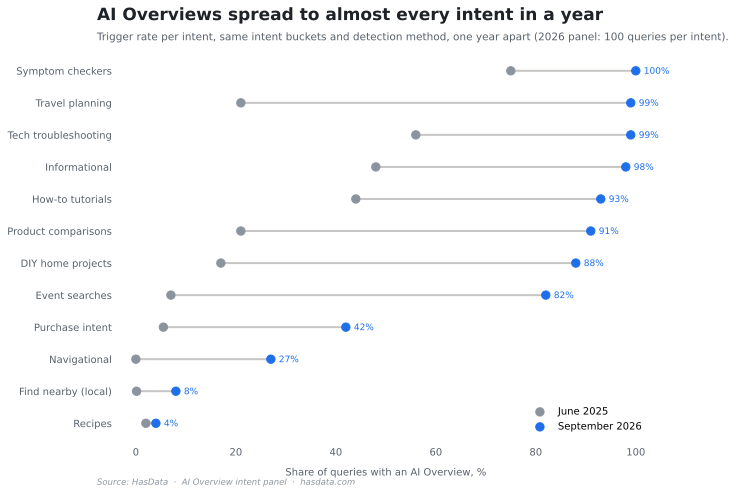

# Google AI Overview Dataset

Data behind [Google AI Overview Study](https://hasdata.com/blog/google-ai-overview-study), a HasData measurement of when Google shows an AI Overview and whom it cites. The core panel is 1,100 queries, 100 per intent bucket across 11 buckets, and an AI Overview appeared on 66.5% of them (732 of 1,100). A second pass re-ran the 1,100 queries with organic results captured and added a 100-query `travel` bucket, 1,200 rows in all, so citation position can be checked against ranking.

The year-over-year chart above is the study's frame, since per-intent trigger rates moved hard between the 2025 run and this panel. The rows behind the 2026 dots are in `data/`, and the 2025 rates come from the study's earlier run, published in the same [article](https://hasdata.com/blog/google-ai-overview-study).

## Table of Contents

- [Files](#files)
- [Schemas](#schemas)
- [Method](#method)
- [License](#license)
- [Disclaimer](#disclaimer)
- [More Resources](#more-resources)

## Files

The `data/` folder holds the panels, `aggregates/` the derived tables, `method/` the collection and analysis scripts.

| File | Rows | What it holds |
|---|---|---|
| `data/aio-dataset.csv` | 1,100 | The flat panel, one query per row with every SERP feature flag and the AI Overview source list |
| `data/aio_panel.json` | 1,100 | The same panel with the full field set, including the featured-snippet domain |
| `data/organic_panel.json` | 1,200 | The second pass, the 1,100 core queries plus a new `travel` bucket, organic results captured per query |
| `data/site_study.json` | 113 domains | The niche-site slice of the study |
| `data/vertical_citations.json` | 1 | Citation counts by content vertical, one aggregate object |
| `aggregates/*.json` | 4 files | Derived tables, position odds, top-1 domains, panel summaries |

The two panels join on `query`, since all 1,100 core queries reappear in the second pass. `site_study.json` is keyed by domain, and `vertical_citations.json` is one aggregate object.

## Schemas

`aio-dataset.csv` has 16 columns. `intent` names the bucket (symptom, tech, howto, diy, informational, navigational, local, events, purchase, comparison, recipe), `query` is the search phrase, `ai_overview` is a 0/1 flag, `sources` carries the cited domains separated by semicolons inside one CSV cell, and the remaining columns are 0/1 flags for the other SERP features (featured snippet, PAA, knowledge graph, local results, recipes, shopping, inline shopping, immersive products, videos, discussions, events, perspectives).

`aio_panel.json` carries the same panel as JSON. The bucket field is `bucket`, the Overview flag is `aio`, `aio_sources` is a proper array, and two fields are extra, `fs_domain` (the featured-snippet holder) and `keys` (the raw response's top-level keys). `organic_panel.json` drops those two and adds `organic`, the captured organic results, and that's the field that lets citation position be compared with ranking.

## Method

Queries were sent through the [HasData SERP API](https://hasdata.com/apis/google-serp-api) from one pipeline, US desktop settings, and each response was parsed for the AI Overview block, its source list, and every other SERP feature. The collection scripts (`aio_panel.py`, `organic_panel.py`, `site_study.py`) read the API key from the `HASDATA_API_KEY` environment variable and write to `method/out/`. `vertical_citations.py` makes no API calls, it aggregates per-article audit data collected outside this repo, so its output ships here as data only. The `analyze_*.py` scripts turn the panels into the aggregate tables.

The study's findings and charts are in the [article](https://hasdata.com/blog/google-ai-overview-study), and every headline number traces to a row set in these files. `charts/aio-position-odds.svg` plots the second pass's citation odds by organic position, built from `aggregates/position_odds.json`.

## License

The dataset is released under [CC BY 4.0](LICENSE). You can copy, share, and adapt it, including commercially, as long as you credit HasData with a link to [hasdata.com](https://hasdata.com) or the [study](https://hasdata.com/blog/google-ai-overview-study).

## Disclaimer

The data comes from search result pages collected for research. Whether and how such collection is appropriate depends on jurisdiction and use, and nothing in this repository is legal advice. [Is Web Scraping Legal?](https://hasdata.com/blog/is-web-scraping-legal) covers how we think about the question.

## More Resources

- [Google AI Overview Study](https://hasdata.com/blog/google-ai-overview-study), the study this data belongs to
- [SERP History](https://hasdata.com/blog/serp-history), a related look at how result pages change over time
